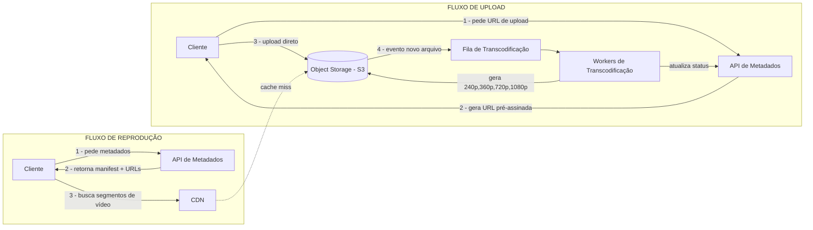
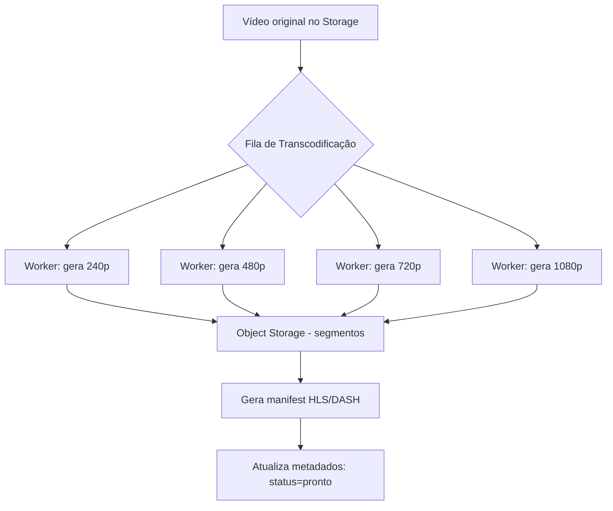

# Entrevista simulada: "Projete o YouTube"

> Uma das perguntas mais clássicas de system design, usada por Google, Meta, Amazon e Netflix. Testa upload de arquivos grandes, transcodificação, CDN e leitura em altíssima escala.
>
> **Entrevistador:** Arquiteto de Software Sênior
> **Candidato:** Você

---

## A pergunta

**Entrevistador:** Vamos começar. Projete um sistema como o YouTube — os usuários podem fazer upload de vídeos e outros usuários podem assisti-los. Como você abordaria isso?

**Você:** Perfeito. Antes de desenhar qualquer coisa, posso fazer algumas perguntas para entender o escopo? "Projetar o YouTube" é um universo gigante, e prefiro confirmar o que está dentro e fora do escopo dos 45 minutos que temos.

**Entrevistador:** Claro, vá em frente.

## Perguntas de esclarecimento (functional requirements)

**Você:** 
1. Precisamos suportar upload e reprodução de vídeo — isso é o core. Recomendações, comentários e monetização estão fora de escopo?
2. É vídeo sob demanda (VOD) ou também live streaming?
3. Precisamos suportar múltiplas resoluções (adaptive bitrate), tipo o usuário no 3G ver 360p e no fibra ver 4K?
4. Qual a escala aproximada? Estamos falando de milhões ou bilhões de usuários?

**Entrevistador:** Boas perguntas. Vamos focar em: upload de vídeo, processamento (transcodificação) e reprodução com múltiplas qualidades. Sem live streaming, sem recomendação — isso pode ser tratado como sistemas à parte. Escala: pense em algo na case de **2 bilhões de usuários ativos por mês**, e **500 horas de vídeo enviadas por minuto**.

**Você:** Entendido. Então o escopo é:
- Upload de vídeo (arquivos grandes, de forma confiável)
- Processamento/transcodificação para múltiplas resoluções
- Armazenamento e entrega via CDN
- Metadados (título, descrição, contagem de views)
- Reprodução com adaptive bitrate streaming

Meta explicitamente fora do escopo: recomendação, busca avançada, comentários, monetização, live streaming. Podemos mencionar rapidamente no final que existem como sistemas separados.

**Entrevistador:** Perfeito, pode seguir.

## Estimativas (back-of-the-envelope)

**Você:** Deixa eu fazer umas contas rápidas pra dimensionar o sistema:

```
500 horas de vídeo por minuto de upload
→ ~720.000 horas de vídeo por dia
→ assumindo 1GB por hora de vídeo original (antes de transcodificar)
→ ~720 TB de dados novos por dia só de upload bruto

Depois de transcodificar em ~5 resoluções (240p, 360p, 480p, 720p, 1080p)
→ o volume de armazenamento facilmente MULTIPLICA por 3-5x
→ estamos falando de ~2-3 PB/dia de armazenamento após processamento

Leituras (assistir vídeo) são MUITO mais frequentes que escritas (upload)
→ proporção típica de leitura:escrita de 100:1 ou mais
→ isso significa que o sistema precisa ser otimizado para LEITURA, com cache agressivo
```

**Entrevistador:** Boa, isso já me diz que você entende que é um sistema **read-heavy**. Continue.

## Alto nível: separando os dois fluxos principais

**Você:** Vou dividir o sistema em dois fluxos independentes, porque eles têm características bem diferentes:

1. **Fluxo de Upload/Processamento** — escreve pouco, mas processa arquivos pesados
2. **Fluxo de Reprodução (Watch)** — lê muito, precisa ser rápido globalmente



**Entrevistador:** Por que você separou o upload do processamento em vez de processar direto na hora do upload?

**Você:** Ótima pergunta. Alguns motivos:
- **Desacoplamento**: se o worker de transcodificação cair, isso não afeta o upload em si — a mensagem fica na fila esperando
- **Escalabilidade independente**: transcodificação é uma tarefa pesada de CPU/GPU. Eu quero escalar os workers de transcodificação de forma independente da API que recebe uploads
- **Confiabilidade**: uploads de vídeos grandes (às vezes gigabytes) não deveriam depender do processamento terminar com sucesso na hora — é assíncrono de propósito

**Entrevistador:** Faz sentido. E por que o cliente faz upload direto pro Object Storage, em vez de mandar pro seu servidor de API primeiro?

**Você:** Porque um vídeo pode ter vários gigabytes. Se o cliente mandar o arquivo inteiro para o meu servidor de API primeiro, e o servidor repassar para o storage, eu transformo meu servidor de aplicação em um "gargalo de transferência de arquivo" — ele fica ocupado e não escala bem. A prática mais usada (é como o próprio S3 da AWS recomenda) é: o servidor de API gera uma **URL pré-assinada (presigned URL)**, com permissão temporária, e o cliente faz upload **diretamente** para o bucket de storage. Também uso **multipart upload**, dividindo o arquivo em pedaços, para permitir retomar o upload se a conexão cair no meio.

**Entrevistador:** Muito bom. Vamos aprofundar na transcodificação agora.

## Deep dive 1: Transcodificação

**Você:** Quando o arquivo original chega no storage, um evento dispara uma mensagem numa fila (por exemplo, Kafka ou SQS). Um pool de workers consome essa fila e faz:

1. Extrai o vídeo em múltiplas resoluções (240p, 360p, 480p, 720p, 1080p, 4K se aplicável)
2. Divide cada resolução em pequenos segmentos (chunks de poucos segundos cada) — isso é o que permite o **adaptive bitrate streaming (ABR)**
3. Gera um arquivo de manifesto (tipo HLS ou DASH) que lista todos os segmentos disponíveis em cada qualidade
4. Gera uma thumbnail
5. Ao terminar, publica um evento de "processamento concluído", que atualiza o banco de metadados



**Entrevistador:** E se um vídeo de 3 horas demorar muito pra processar? Isso não trava a fila para os outros vídeos?

**Você:** Boa pegadinha. Eu evitaria isso de duas formas:
1. **Filas separadas por prioridade/tamanho** — vídeos curtos numa fila, vídeos longos em outra, para um vídeo gigante não bloquear a fila inteira
2. **Paralelizar o próprio vídeo**: em vez de um worker processar o vídeo inteiro do início ao fim, divido o vídeo original em pedaços e processo os pedaços em paralelo em workers diferentes, depois "costuro" os segmentos de volta

**Entrevistador:** Bom raciocínio. Vamos falar de como o vídeo chega até o usuário agora.

## Deep dive 2: CDN e entrega de vídeo

**Você:** Essa é provavelmente a parte mais crítica do sistema, porque é onde mora o maior custo (banda) e a maior sensibilidade de latência.

Quando o usuário clica em "play":
1. O app pede os metadados e a URL do manifesto para a API
2. A API retorna a URL do manifesto — que aponta para a **CDN**, não direto pro nosso storage
3. O player do cliente lê o manifesto e começa a baixar segmentos de vídeo, ajustando a qualidade dinamicamente conforme a banda disponível (isso é o ABR)
4. A CDN, se não tiver o segmento em cache (cache miss), busca no storage de origem uma vez, e depois serve pra todos os próximos usuários daquela região a partir do cache

**Entrevistador:** Por que CDN é tão importante aqui especificamente?

**Você:** Porque vídeo é o tipo de conteúdo mais "read-heavy" que existe — um vídeo popular pode ser assistido milhões de vezes, mas foi enviado (escrito) só uma vez. Sem CDN, toda essa demanda de leitura bateria direto no nosso storage de origem, o que:
- Criaria latência gigante para usuários longe do data center de origem
- Custaria uma fortuna em egress (saída de dados)
- Criaria um ponto único de gargalo

Com CDN, o conteúdo popular fica cacheado nas "bordas" (edge locations) próximas geograficamente dos usuários. **Vídeos populares (cabeça da distribuição) ficam bem cacheados; vídeos raros (cauda longa) podem ser buscados sob demanda da origem.**

**Entrevistador:** E os metadados, tipo contagem de views? Como você lida com isso em escala?

**Você:** Eu separaria os metadados em duas categorias:
- **Dados estáveis** (título, descrição, duração): raramente mudam, cache com TTL mais longo
- **Contadores voláteis** (views, likes): mudam o tempo inteiro. Eu não incrementaria direto no banco a cada view — isso criaria contenção gigante. Eu bufferizaria os incrementos (por exemplo, em Redis ou numa fila) e faria writes em batch periodicamente pro banco principal, aceitando uma pequena janela de inconsistência (eventual consistency) na contagem exibida.

**Entrevistador:** Excelente. Vamos falar de trade-offs agora — o que você sacrificaria e por quê?

## Trade-offs (o que o entrevistador realmente quer ouvir)

**Você:**

| Decisão | Trade-off |
|---|---|
| CDN cacheia agressivamente | Ganha latência e reduz custo de origem, mas conteúdo pode ficar temporariamente desatualizado (aceitável para vídeo) |
| Contagem de views é eventualmente consistente | Aceito ver "999" em vez de "1000" por alguns segundos, em troca de não sobrecarregar o banco |
| Metadados de propriedade do vídeo (quem é o dono) precisam ser fortemente consistentes | Aqui eu NÃO aceitaria eventual consistency — não posso deixar o vídeo aparecer com o dono errado |
| Upload direto pro storage (bypass do servidor de app) | Mais complexo de implementar (URLs assinadas, multipart), mas evita que a API vire gargalo |
| Sharding de metadados por `video_id` | Distribui bem a carga, mas dificulta operações que cruzam vários vídeos de um mesmo usuário |

**Entrevistador:** Perfeito. Como você lidaria com falhas? Por exemplo, um worker de transcodificação cai no meio do processamento.

**Você:** Como a arquitetura é baseada em fila, isso é resolvido de forma relativamente natural:
- A mensagem só é removida da fila quando o worker confirma sucesso (**acknowledgement**)
- Se o worker cair antes de confirmar, a mensagem volta pra fila automaticamente e outro worker pega
- Eu adicionaria um **número máximo de tentativas** e, se exceder, a mensagem vai pra uma **dead-letter queue** para investigação manual, em vez de ficar tentando para sempre

**Entrevistador:** Muito bom. Acho que cobrimos os pontos principais. Última pergunta: se você tivesse mais tempo, o que aprofundaria?

**Você:** Eu exploraria:
1. Estratégia de multi-região para o storage de origem (não só CDN)
2. Como lidar com "hot keys" — vídeos virais que recebem tráfego desproporcional
3. Pipeline de moderação de conteúdo antes do vídeo ficar público
4. Como o sistema de recomendação se conectaria a esse design (provavelmente como um serviço consumidor de eventos, sem acoplar diretamente ao pipeline de upload)

**Entrevistador:** Ótima entrevista. Cobrimos upload assíncrono, transcodificação paralela, CDN e estratégias de consistência — exatamente os pontos que eu esperava ver num candidato sênior.

---

## Resumo dos conceitos usados nessa entrevista

- Upload direto para object storage via URL pré-assinada (evita gargalo na API)
- Processamento assíncrono via fila (ver [06 - Filas e Mensageria](./06-filas-e-mensageria.md))
- CDN para leitura em escala (conteúdo "read-heavy")
- Separação entre dados estáveis e voláteis no cache (ver [03 - Cache](./03-cache.md))
- Eventual consistency para contadores, forte consistência para dados de propriedade (ver [02 - CAP Theorem](./02-cap-theorem.md))
- Escalabilidade horizontal dos workers (ver [01 - Escalabilidade](./01-escalabilidade.md))

---
**Próxima entrevista:** [08 - Encurtador de URL (estilo Bit.ly)](./08-entrevista-url-shortener.md)
