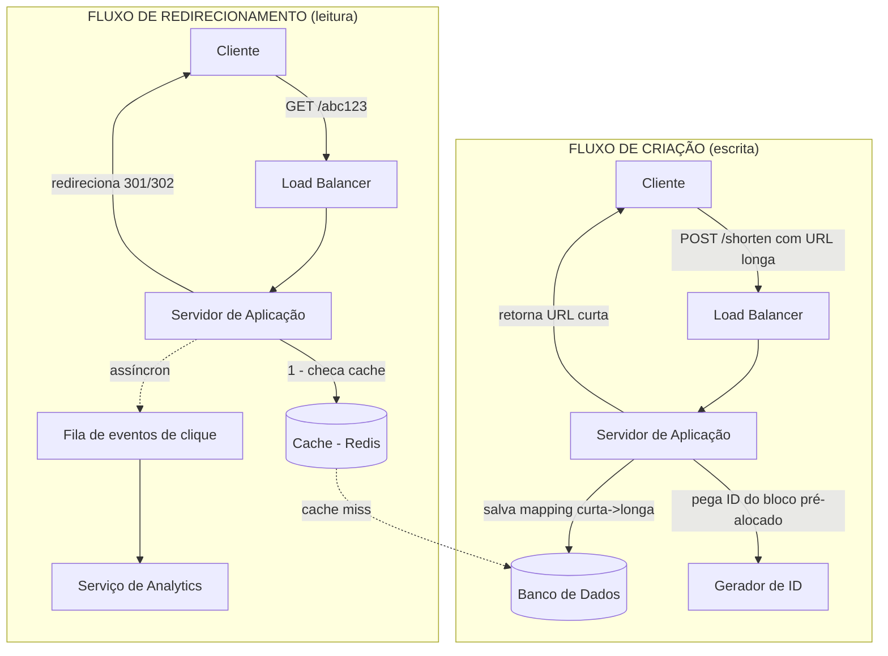

# Entrevista simulada: "Projete um encurtador de URL (estilo Bit.ly/TinyURL)"

> Uma das perguntas mais usadas em entrevistas — justamente por ser "simples" na superfície, mas exercitar sharding, cache, hashing e sistemas read-heavy num escopo pequeno e controlável.
>
> **Entrevistador:** Arquiteto de Software Sênior
> **Candidato:** Você

---

## A pergunta

**Entrevistador:** Projete um serviço de encurtamento de URLs, como o Bit.ly. O usuário manda uma URL longa, o sistema devolve uma URL curta. Quando alguém acessa a URL curta, é redirecionado para a original.

**Você:** Legal, gosto dessa. Antes de desenhar, deixa eu alinhar o escopo com algumas perguntas.

## Perguntas de esclarecimento

**Você:**
1. As URLs curtas expiram em algum momento, ou são permanentes?
2. Precisamos de contas de usuário (histórico de links criados, analytics de cliques)?
3. O usuário pode escolher um "alias" customizado (ex: bit.ly/meu-produto), ou é sempre gerado automaticamente?
4. Qual a escala esperada — quantas URLs novas por dia, e qual a proporção de leitura (redirecionamento) para escrita (criação)?

**Entrevistador:** Boas perguntas. Vamos assumir: URLs não expiram por padrão, mas o usuário pode opcionalmente definir uma expiração. Sim, precisamos de analytics básico (contagem de cliques). Sim, suporte a alias customizado é um bônus, não o foco principal. Escala: **100 milhões de URLs novas por mês**, e a proporção de leitura para escrita é de **100:1** — ou seja, um link é criado uma vez, mas clicado muitas vezes.

**Você:** Entendido. Isso já me diz uma coisa importante: esse sistema é fortemente **read-heavy**, então cache vai ser essencial. Deixa eu fazer as contas de capacidade antes de desenhar.

## Estimativas (back-of-the-envelope)

**Você:**

```
100 milhões de URLs novas / mês
→ ~3,3 milhões / dia
→ ~40 escritas por segundo (média)

Com proporção de leitura:escrita de 100:1
→ ~4.000 leituras (redirecionamentos) por segundo em média
→ picos podem ser bem maiores, digamos 10x a média em horários de pico → ~40.000 leituras/s no pico

Se cada URL + metadados ocupam ~500 bytes
→ 100 milhões/mês * 12 meses * 5 anos * 500 bytes ≈ ~300 GB em 5 anos

Isso é um volume de dados relativamente pequeno — cabe tranquilamente
em um banco relacional ou até em cache, o desafio real aqui é
volume de LEITURA e LATÊNCIA, não volume de armazenamento.
```

**Entrevistador:** Boa, você já identificou que o gargalo é leitura, não armazenamento. Como você geraria o código curto?

## Deep dive 1: Como gerar a URL curta

**Você:** Existem algumas abordagens. Vou comparar rapidamente:

**Opção A — Hash da URL original (ex: MD5, SHA-256, pegando os primeiros caracteres)**
- Problema: colisões. Duas URLs diferentes podem gerar o mesmo hash truncado, e eu precisaria checar e tratar isso.

**Opção B — Contador incremental + conversão para Base62**
- Eu mantenho um contador global incremental (1, 2, 3, 4...)
- Converto esse número para uma string usando Base62 (0-9, a-z, A-Z), que é bem mais compacta que decimal
- Por exemplo, o número `125` em Base62 vira algo como `"cb"` — bem mais curto

```
125 → Base62 → "cb"
100000 → Base62 → "q0U"
```

Eu prefiro a **Opção B**, porque elimina completamente o problema de colisão — cada número gera um código único e garantido. O desafio é: como gerar esse contador de forma distribuída, sem virar um gargalo?

**Entrevistador:** Boa pergunta — como você resolveria isso?

**Você:** Eu **pré-alocaria blocos de IDs** para cada servidor de aplicação. Por exemplo, o servidor A pega o intervalo de IDs de 1 a 1.000.000, o servidor B pega de 1.000.001 a 2.000.000, e assim por diante. Cada servidor consome da sua própria faixa localmente, sem precisar coordenar com os outros a cada requisição — só volta a pedir um novo bloco quando o atual acabar. Isso evita que um contador centralizado vire ponto único de contenção.

**Entrevistador:** Gostei dessa solução. E o alias customizado, como se encaixa?

**Você:** Para alias customizado, eu simplesmente verifico se aquele texto já existe na tabela antes de salvar (constraint de unicidade no banco). Se já existir, retorno erro pedindo outro alias.

## Alto nível da arquitetura



**Entrevistador:** Por que você separou o registro do clique (analytics) de forma assíncrona, em vez de gravar direto no banco na hora do redirecionamento?

**Você:** Porque o redirecionamento precisa ser **extremamente rápido** — é a operação mais frequente do sistema (lembra, 4.000 a 40.000 por segundo). Se cada redirecionamento tivesse que esperar uma escrita síncrona no banco de analytics antes de responder ao usuário, eu estaria adicionando latência desnecessária numa operação crítica de leitura. Em vez disso, eu publico um evento numa fila (ver conceito de [Filas e Mensageria](./06-filas-e-mensageria.md)) e um serviço consumidor separado processa esses eventos de analytics em background, sem impactar a velocidade do redirecionamento.

## Deep dive 2: Cache e banco de dados

**Entrevistador:** Fala mais sobre a escolha do banco de dados. SQL ou NoSQL?

**Você:** Esse é um caso de uso bem simples do ponto de vista de dados: é essencially uma tabela **chave-valor** (código curto → URL longa), sem necessidade de relacionamentos complexos ou joins. Isso favorece fortemente o uso de um **banco NoSQL do tipo key-value** (como DynamoDB ou Cassandra), que escala horizontalmente com muito mais facilidade que um relacional para esse padrão de acesso.

Dito isso, se o volume fosse bem menor, um banco relacional como PostgreSQL resolveria perfeitamente — a decisão realmente depende da escala. Como estamos falando de centenas de milhões de registros com necessidade de baixíssima latência de leitura, eu iria de NoSQL key-value.

**Entrevistador:** E o cache — onde ele entra exatamente?

**Você:** Como a proporção de leitura é 100:1, cache é praticamente obrigatório aqui. Eu colocaria um **Redis na frente do banco**, guardando os mapeamentos mais acessados (padrão de cache que vimos: [cache-aside](./03-cache.md)):

1. Redirecionamento chega
2. Servidor checa o Redis primeiro
3. Se encontrar (**cache hit**), redireciona imediatamente — nem toca no banco
4. Se não encontrar (**cache miss**), busca no banco, redireciona, e já aproveita para popular o cache para a próxima vez

Dado que a distribuição de acessos costuma seguir uma **lei de potência** (poucos links recebem a maioria dos cliques — os "virais"), um cache relativamente pequeno já consegue absorver a grande maioria do tráfego de leitura.

**Entrevistador:** E se um link específico viralizar e receber uma quantidade desproporcional de tráfego — o que os profissionais chamam de "hot key"?

**Você:** Boa pegadinha, bem comum em entrevista sênior. Algumas estratégias:
1. Esse link específico fica no cache com TTL mais longo, já que sabemos que vai continuar sendo acessado
2. Se um único nó de cache não aguentar (mesmo sendo só uma chave), posso **replicar essa chave específica em múltiplos nós de cache** e balancear a leitura entre eles
3. Em casos extremos, uso um cache local na própria camada de aplicação (in-memory, tipo um mini-cache dentro do processo do servidor), reduzindo ainda mais viagens até o Redis

## Trade-offs

**Você:**

| Decisão | Trade-off |
|---|---|
| Contador + Base62 em vez de hash | Elimina colisões, mas exige coordenação de blocos de ID entre servidores |
| NoSQL key-value | Escala melhor para esse padrão simples de acesso, mas perde flexibilidade de queries relacionais |
| Cache agressivo (Redis) | Reduz latência e carga no banco, mas introduz o problema de invalidação (o que fazer quando alguém deleta um link?) |
| Analytics assíncrono | Redirecionamento fica rápido, mas contagem de cliques tem uma pequena defasagem (eventual consistency) |
| Redirecionamento HTTP 301 vs 302 | 301 (permanente) é cacheado pelo navegador, reduzindo carga no meu servidor, mas eu perco a capacidade de rastrear cliques subsequentes daquele navegador. 302 (temporário) sempre passa pelo meu servidor, permitindo analytics completo — eu escolheria 302 aqui, já que analytics é requisito |

**Entrevistador:** Boa observação sobre 301 vs 302, muita gente esquece disso. Como você lidaria com o gerador de ID sendo um ponto único de falha?

**Você:** Eu rodaria múltiplas instâncias do serviço gerador de ID, cada uma responsável por faixas diferentes e não sobrepostas de números (por exemplo, uma instância gera só números pares, outra só ímpares — ou de forma mais robusta, uso um serviço como o Zookeeper para coordenar a distribuição de blocos sem conflito). Assim, se uma instância cair, as outras continuam operando normalmente.

**Entrevistador:** Ótimo. Acho que cobrimos tudo que eu queria. Muito boa entrevista — você conseguiu de forma clara justificar cada decisão com o trade-off correspondente, que é exatamente o que eu, como entrevistador, quero ouvir de um candidato sênior.

---

## Resumo dos conceitos usados nessa entrevista

- Geração de ID distribuída sem coordenação central a cada request (relacionado a [01 - Escalabilidade](./01-escalabilidade.md))
- Cache-aside para absorver tráfego de leitura (ver [03 - Cache](./03-cache.md))
- Escolha entre SQL e NoSQL baseada no padrão de acesso (ver [05 - Bancos de Dados](./05-bancos-de-dados-sql-nosql.md))
- Processamento assíncrono de analytics via fila (ver [06 - Filas e Mensageria](./06-filas-e-mensageria.md))
- Load balancer distribuindo tráfego entre servidores de aplicação (ver [04 - Load Balancer](./04-load-balancer.md))

---
**Anterior:** [07 - Entrevista YouTube](./07-entrevista-youtube.md) | **Próxima entrevista:** [09 - Feed do Twitter](./09-entrevista-twitter-feed.md)
