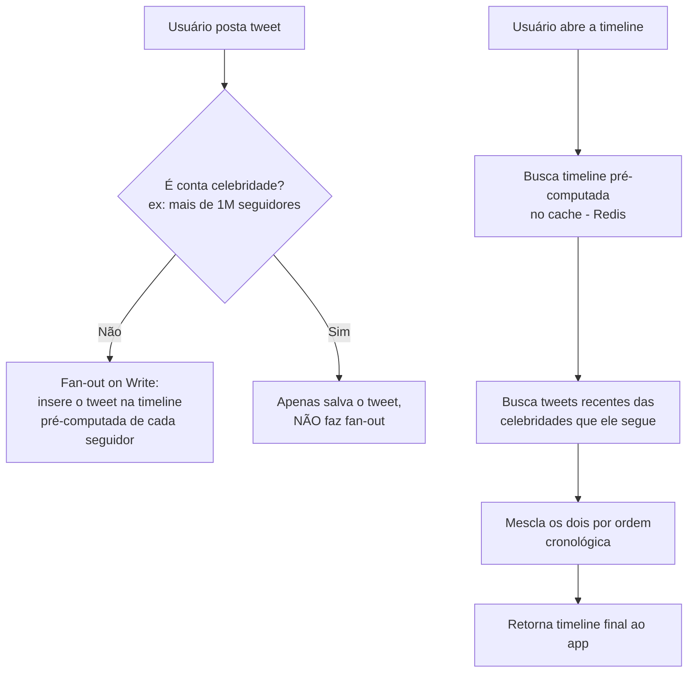
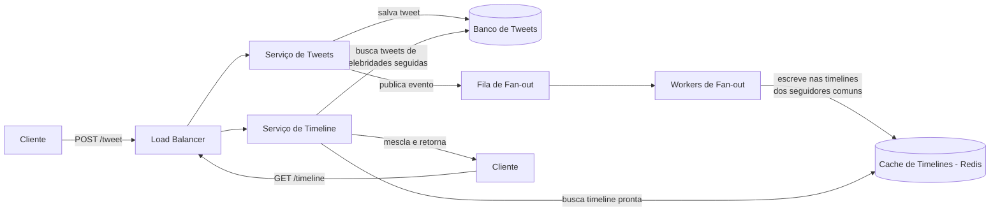

# Entrevista simulada: "Projete a timeline/feed do Twitter"

> Uma das perguntas mais associadas a Meta, Google e ao próprio Twitter/X. O ponto central é o problema de "fan-out" — como distribuir um post para milhões de seguidores sem derrubar o sistema.
>
> **Entrevistador:** Arquiteto de Software Sênior
> **Candidato:** Você

---

## A pergunta

**Entrevistador:** Projete o sistema de timeline do Twitter. Um usuário posta um tweet, e esse tweet deve aparecer na timeline de todos os seus seguidores.

**Você:** Ótimo, essa é uma das perguntas que eu mais gosto justamente pelo problema de distribuição que ela expõe. Antes de ir para o quadro, posso alinhar o escopo?

## Perguntas de esclarecimento

**Você:**
1. A timeline precisa estar ordenada estritamente por tempo (cronológica), ou pode ter algum tipo de ranking/algoritmo (like o feed atual do Twitter)?
2. Precisamos suportar likes, retweets e comentários nessa fase, ou só a criação e leitura de tweets?
3. Existe algum usuário com um volume de seguidores desproporcional (contas "celebridade" com dezenas de milhões de seguidores)?
4. Qual a escala? Quantos usuários ativos e quantos tweets por segundo, aproximadamente?

**Entrevistador:** Boas perguntas. Vamos simplificar: timeline **cronológica** por enquanto (podemos falar de ranking no final, se der tempo). Foco em postar e ler tweets — sem likes/comentários por ora. Sim, contas de celebridade com até **50 milhões de seguidores** existem e precisam ser suportadas. Escala: **300 milhões de usuários ativos**, e cerca de **5.000 tweets novos por segundo** em média.

**Você:** Entendido. Isso confirma que o desafio central aqui é **fan-out** — como levar um tweet até todos os seguidores de forma eficiente, especialmente quando existem contas com dezenas de milhões de seguidores. Deixa eu fazer as contas antes de desenhar.

## Estimativas (back-of-the-envelope)

**Você:**

```
5.000 tweets novos / segundo (escritas)

Assumindo, em média, 200 seguidores por usuário
→ se cada tweet fosse "empurrado" para a timeline de cada seguidor na hora do post:
5.000 tweets/s * 200 seguidores = 1.000.000 de escritas/segundo na timeline

Isso é MUITO tráfego de escrita gerado a partir de um volume
relativamente pequeno de tweets. Esse é o cerne do problema de fan-out.

Proporção de leitura (ver timeline) para escrita (postar tweet)
costuma ser bem alta, algo como 100:1 a 1000:1
→ o sistema é fortemente READ-HEAVY, mas o desafio de escrita
   está concentrado no momento do fan-out
```

**Entrevistador:** Exatamente esse é o ponto que eu queria que você chegasse. Como você resolveria esse fan-out?

## Deep dive 1: Estratégias de Fan-out

**Você:** Existem basicamente duas abordagens, e cada uma tem um trade-off bem claro:

### Fan-out on Write (push) — gerar a timeline no momento do post

Quando o usuário posta um tweet, o sistema imediatamente insere esse tweet na timeline pré-computada de **cada um dos seus seguidores** (geralmente guardada em um cache, tipo Redis, como uma lista por usuário).

- **Vantagem:** ler a timeline é extremamente rápido — é só buscar a lista já pronta
- **Desvantagem:** se um usuário tem 50 milhões de seguidores, postar um único tweet gera 50 milhões de escritas. Isso é o chamado **problema da celebridade (celebrity problem)**

### Fan-out on Read (pull) — gerar a timeline no momento da leitura

O tweet é salvo uma única vez. Quando um usuário abre sua timeline, o sistema busca os tweets mais recentes de **todas as pessoas que ele segue**, e monta a timeline na hora.

- **Vantagem:** postar um tweet é uma operação barata (uma única escrita), não importa quantos seguidores o autor tenha
- **Desvantagem:** ler a timeline fica mais lento e custoso, porque precisa agregar dados de centenas de contas toda vez que o usuário abre o app

**Entrevistador:** E qual das duas você escolheria?

**Você:** Nenhuma das duas isoladamente — eu usaria uma **abordagem híbrida**, que é exatamente o que sistemas reais como Twitter fazem na prática:

- Para a **grande maioria dos usuários** (contas normais, com poucos milhares de seguidores no máximo): uso **fan-out on write**. A escrita é barata o suficiente, e a leitura fica extremamente rápida.
- Para **contas celebridade** (acima de, digamos, 1 milhão de seguidores): uso **fan-out on read**. Em vez de empurrar o tweet para milhões de timelines, eu deixo o tweet "parado" e, na hora de montar a timeline de cada seguidor, eu **mesclo** a timeline pré-computada (dos usuários normais que ele segue) com os tweets recentes das celebridades que ele segue, buscados sob demanda.



**Entrevistador:** Interessante. Como você identifica se uma conta é "celebridade" no momento do post, de forma rápida?

**Você:** Eu manteria um contador de seguidores por usuário, atualizado de forma assíncrona (não precisa ser em tempo real exato), e um **flag simples** no perfil do usuário indicando se ele está acima do limiar. Assim, na hora de postar, é só uma leitura rápida desse flag — não preciso contar seguidores na hora.

## Alto nível da arquitetura



**Entrevistador:** Por que você colocou uma fila entre o serviço de tweets e os workers de fan-out, em vez de fazer o fan-out diretamente na requisição de post?

**Você:** Pelo mesmo motivo que vimos no processamento assíncrono em geral: eu não quero que o usuário espere o fan-out completo (que pode envolver escrever em milhares de timelines) para receber a confirmação de que o tweet foi postado. O tweet é salvo, o usuário recebe confirmação imediatamente, e o fan-out acontece em background através da fila. Isso também me dá resiliência: se um worker cair no meio do processo, a fila garante que o trabalho não se perde.

## Deep dive 2: Onde armazenar timelines e tweets

**Entrevistador:** Que tipo de banco de dados você usaria para os tweets em si, e para as timelines pré-computadas?

**Você:** São dois padrões de acesso bem diferentes:

- **Tweets**: dados relativamente simples (texto, autor, timestamp, id), com alto volume de escrita e necessidade de escalar horizontalmente. Eu usaria um banco NoSQL wide-column, como Cassandra, particionado por `tweet_id` ou por `user_id + timestamp`. Isso escala bem para volume gigantesco de escrita.
- **Timelines pré-computadas**: aqui, o padrão de acesso é "me dê a lista dos últimos N tweets desse usuário, rapidinho". Isso é um caso de uso perfeito para **cache em memória**, como Redis, guardando algo como uma lista ordenada de `tweet_ids` por usuário — não preciso guardar o conteúdo completo do tweet na timeline, só a referência, e busco o conteúdo completo (com cache também) quando for exibir.

**Entrevistador:** E se o Redis, que guarda as timelines, cair? Isso significa que ninguém consegue ver a timeline?

**Você:** Boa pergunta de resiliência. Eu trataria isso com um **fallback**: se o cache de timeline não estiver disponível, o sistema recorre ao modo "fan-out on read" temporariamente — busca os tweets recentes direto do banco de tweets, das pessoas que o usuário segue, mesmo que isso seja mais lento. Não é a experiência ideal, mas evita que o app fique completamente fora do ar. Além disso, eu manteria réplicas do Redis (replicação master-slave) para reduzir a chance desse cenário acontecer.

## Trade-offs

**Você:**

| Decisão | Trade-off |
|---|---|
| Fan-out híbrido (write + read) | Resolve o problema da celebridade, mas adiciona complexidade: preciso de lógica extra para mesclar as duas fontes na leitura |
| Timeline cronológica (não ranking) | Mais simples de implementar e reduz custo computacional, mas um algoritmo de ranking poderia aumentar engajamento — trade-off de produto, não só técnico |
| Cache de timeline no Redis | Leitura extremamente rápida, mas introduz um novo componente crítico que precisa de estratégia de fallback |
| Fan-out assíncrono via fila | Postar um tweet fica rápido para o usuário, mas os seguidores podem ver o tweet novo com um pequeno atraso (eventual consistency) |
| Cassandra para armazenar tweets | Escala muito bem horizontalmente para escrita, mas não é ideal para queries relacionais complexas (o que está OK aqui, pois não precisamos disso) |

**Entrevistador:** Muito boa cobertura. Uma última pergunta: se eu pedir para você adicionar "likes" e "retweets" ao sistema agora, o que mudaria?

**Você:** Eu trataria como um **contador assíncrono**, parecido com o que vimos no design do YouTube para views: os likes não seriam escritos de forma síncrona no tweet a cada clique (isso criaria contenção gigante em tweets virais). Em vez disso, eu bufferizaria os incrementos numa fila ou em Redis, e faria updates em batch periodicamente no banco principal. Retweets eu trataria de forma similar a um novo "tweet" que referencia o original, reaproveitando o mesmo pipeline de fan-out que já desenhamos.

**Entrevistador:** Perfeito, acho que você demonstrou muito bem o entendimento do problema de fan-out e como resolvê-lo de forma híbrida — esse é exatamente o "AHA moment" que eu busco nessa pergunta.

---

## Resumo dos conceitos usados nessa entrevista

- Fan-out on write vs fan-out on read (trade-off central dessa entrevista)
- Processamento assíncrono via fila para desacoplar postagem de distribuição (ver [06 - Filas e Mensageria](./06-filas-e-mensageria.md))
- Cache para servir timelines pré-computadas rapidamente (ver [03 - Cache](./03-cache.md))
- Escolha de banco NoSQL wide-column para escrita em alta escala (ver [05 - Bancos de Dados](./05-bancos-de-dados-sql-nosql.md))
- Eventual consistency aceitável para timeline e contadores (ver [02 - CAP Theorem](./02-cap-theorem.md))

---
**Anterior:** [08 - Encurtador de URL](./08-entrevista-url-shortener.md) | **Próxima entrevista:** [10 - WhatsApp](./10-entrevista-whatsapp.md)
