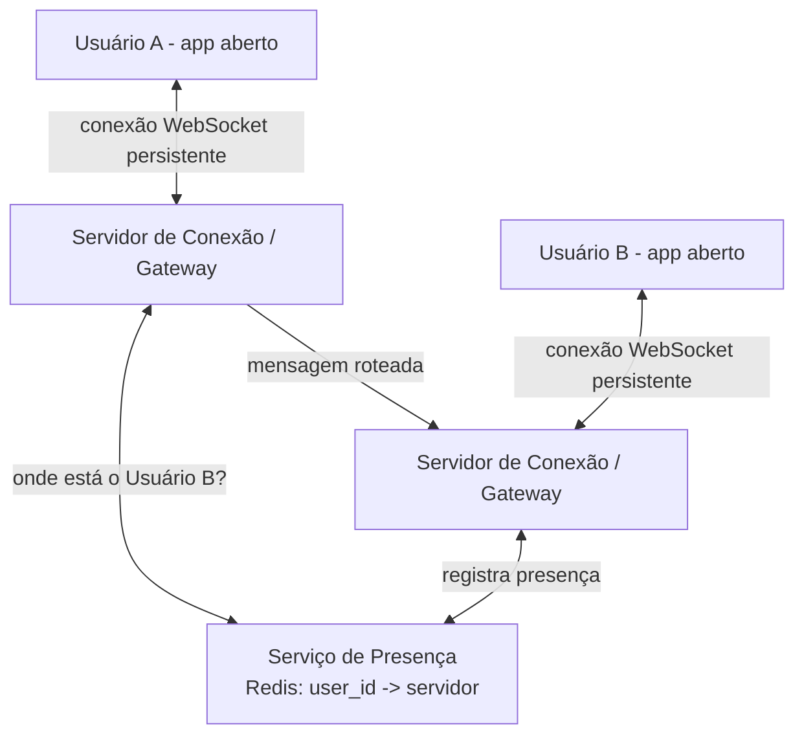
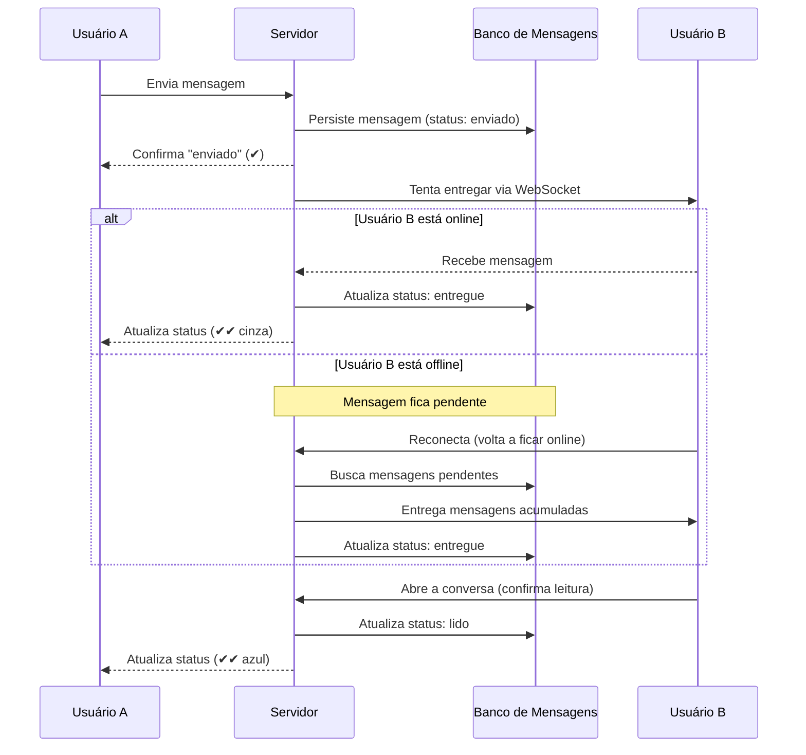

# Entrevista simulada: "Projete um sistema de mensagens como o WhatsApp"

> Pergunta clássica usada por Meta, Amazon e Microsoft. O foco está em comunicação em tempo real, garantias de entrega de mensagens e status (enviado/entregue/lido).
>
> **Entrevistador:** Arquiteto de Software Sênior
> **Candidato:** Você

---

## A pergunta

**Entrevistador:** Projete um sistema de mensagens instantâneas como o WhatsApp. Os usuários devem poder trocar mensagens de texto em tempo real, um-para-um.

**Você:** Legal. Deixa eu confirmar o escopo antes de começar a desenhar.

## Perguntas de esclarecimento

**Você:**
1. Vamos focar só em conversas um-para-um, ou também precisamos suportar grupos nessa primeira versão?
2. Precisamos de status de entrega — "enviado", "entregue" e "lido" (os famosos dois tracinhos azuis)?
3. Precisamos suportar envio de mídia (foto, vídeo, áudio), ou só texto por enquanto?
4. O usuário pode estar offline — nesse caso, a mensagem deve ficar armazenada até ele voltar a ficar online?
5. Qual a escala esperada?

**Entrevistador:** Boas perguntas. Vamos focar em: conversas **um-para-um** apenas (grupos podem ser mencionados no final, se sobrar tempo). Sim, precisamos dos três status de entrega. Vamos manter só **texto** por enquanto — mídia pode ser tratada como uma extensão, reaproveitando conceitos que já vimos no design do YouTube para upload de arquivos grandes. Sim, mensagens para usuários offline devem ser entregues quando ele voltar. Escala: **2 bilhões de usuários**, com **100 bilhões de mensagens trocadas por dia**.

**Você:** Entendido. Isso me diz que o desafio central aqui não é tanto volume de armazenamento (mensagens de texto são pequenas), mas sim **manter conexões em tempo real com bilhões de dispositivos simultaneamente**, e garantir a entrega mesmo quando o destinatário está offline.

## Estimativas (back-of-the-envelope)

**Você:**

```
100 bilhões de mensagens / dia
→ ~1,15 milhão de mensagens por segundo (média)
→ picos podem ser bem maiores (ex: virada de ano) — vamos considerar
  algo como 5-10x a média no pico → ~10 milhões de mensagens/segundo

Se cada usuário estiver com o app aberto, precisamos manter
uma conexão persistente (ex: WebSocket) por dispositivo ativo
→ com 2 bilhões de usuários, mesmo que só uma fração esteja
  online ao mesmo tempo (digamos 20%), isso é ~400 milhões
  de conexões simultâneas para gerenciar

Isso é o verdadeiro desafio de escala aqui: não é volume de dados,
é volume de CONEXÕES PERSISTENTES simultâneas.
```

**Entrevistador:** Exatamente, esse é o ponto-chave dessa pergunta. Como você manteria essas conexões?

## Deep dive 1: Conexões em tempo real (WebSocket vs HTTP tradicional)

**Você:** HTTP tradicional é um modelo de requisição-resposta: o cliente pede, o servidor responde, e a conexão fecha. Isso não funciona bem para mensagens em tempo real, porque o servidor precisaria de um jeito de **iniciar** a comunicação com o cliente (avisar "você recebeu uma mensagem nova") sem que o cliente peça primeiro.

Por isso, eu usaria **WebSocket** — uma conexão bidirecional e persistente entre o cliente e um servidor. Uma vez estabelecida, tanto o cliente quanto o servidor podem enviar dados a qualquer momento, sem precisar reabrir a conexão.



**Entrevistador:** Com bilhões de usuários, um único servidor de WebSocket não aguenta todo mundo. Como você distribui isso?

**Você:** Eu teria um **pool de servidores de conexão (gateways)**, e cada usuário, ao abrir o app, é conectado a **um** desses servidores (via load balancer). O grande desafio então é: se o Usuário A está conectado ao Servidor 1, e quer mandar mensagem para o Usuário B, que está conectado ao Servidor 5 — como o Servidor 1 sabe onde encontrar o Servidor 5?

Para isso, eu manteria um **serviço de presença**: um registro rápido (tipicamente em Redis) que mapeia `user_id → qual servidor de conexão ele está conectado agora`. Quando o Servidor 1 recebe a mensagem do Usuário A, ele consulta esse registro, descobre que o Usuário B está no Servidor 5, e repassa a mensagem internamente entre os servidores até chegar no destino.

**Entrevistador:** E se o Usuário B estiver offline no momento — o que acontece com a mensagem?

## Deep dive 2: Entrega garantida e usuários offline

**Você:** Nesse caso, a mensagem precisa ser **persistida** em algum lugar até o destinatário voltar a ficar online. Eu desenharia o fluxo assim:

1. Usuário A envia a mensagem
2. O servidor salva a mensagem imediatamente em um **banco de mensagens pendentes**, e marca como status "enviado" (✔ um tracinho)
3. O servidor tenta entregar em tempo real via WebSocket, consultando o serviço de presença
4. **Se o Usuário B estiver online**: a mensagem é entregue imediatamente, status muda para "entregue" (✔✔ dois tracinhos cinza)
5. **Se o Usuário B estiver offline**: a mensagem fica na fila de pendências daquele usuário
6. Quando o Usuário B abre o app e reconecta, o servidor busca todas as mensagens pendentes e entrega, atualizando o status para "entregue"
7. Quando o Usuário B efetivamente abre a conversa e lê, o app dele manda uma confirmação de leitura, e o status muda para "lido" (✔✔ azul)



**Entrevistador:** Por que persistir a mensagem antes mesmo de tentar entregar, em vez de só tentar entregar e persistir apenas se falhar?

**Você:** Porque isso me dá uma garantia de **"at-least-once delivery"** — ou seja, a mensagem nunca é perdida, mesmo que o servidor caia bem no meio do processo de entrega. Se eu só persistisse em caso de falha, existiria uma janela onde a mensagem estaria "no ar", sem estar nem entregue nem salva, e uma queda do servidor nesse exato momento causaria perda de mensagem — o que é inaceitável nesse tipo de produto.

**Entrevistador:** Boa. E qual banco de dados você usaria para armazenar as mensagens?

**Você:** O padrão de acesso aqui é bem específico: eu praticamente sempre busco "as mensagens de uma conversa específica, em ordem cronológica". Isso favorece um banco NoSQL wide-column, como Cassandra, particionado por `conversation_id`, com as mensagens ordenadas por timestamp dentro de cada partição. Esse tipo de banco lida muito bem com volume altíssimo de escrita (lembra, ~1 milhão de mensagens por segundo em média) e permite escalar horizontalmente adicionando mais nós.

## Deep dive 3: Sincronização entre múltiplos dispositivos

**Entrevistador:** E se o usuário tiver o WhatsApp aberto no celular E no computador ao mesmo tempo?

**Você:** Boa pergunta de profundidade. Eu trataria cada dispositivo como uma "conexão" separada vinculada ao mesmo `user_id` no serviço de presença — ou seja, um usuário pode ter múltiplas entradas ativas (um dispositivo = um servidor de conexão + socket). Quando uma mensagem chega para esse usuário, o sistema notifica **todos** os dispositivos conectados simultaneamente, não só um. A confirmação de "lido" também precisaria ser sincronizada entre os dispositivos — se o usuário lê a mensagem no celular, o computador também precisa saber que essa conversa já foi lida, para não mostrar a notificação de novo.

## Trade-offs

**Você:**

| Decisão | Trade-off |
|---|---|
| WebSocket em vez de HTTP polling | Permite comunicação bidirecional real, mas exige manter conexões persistentes abertas, o que consome mais recursos do servidor do que requisições HTTP tradicionais sem estado |
| Serviço de presença centralizado (Redis) | Permite rotear mensagens entre servidores de conexão diferentes, mas se cair, o roteamento de mensagens em tempo real fica comprometido — eu adicionaria réplicas |
| Persistir a mensagem antes de tentar entregar | Garante que nenhuma mensagem se perde (at-least-once), mas exige que o cliente trate possíveis duplicatas de forma idempotente |
| Cassandra para armazenar mensagens | Escala muito bem para escrita em altíssimo volume, mas não é ideal para buscas que não sigam o padrão de partição por conversa |
| Múltiplos dispositivos por usuário | Melhora a experiência do usuário, mas multiplica a complexidade de sincronização de status de leitura |

**Entrevistador:** Última pergunta: como você lidaria com privacidade — o conteúdo das mensagens deveria ser visível para o seu próprio backend?

**Você:** Essa é uma decisão de produto tão importante quanto técnica. Para replicar o que o WhatsApp realmente faz, eu implementaria **criptografia de ponta a ponta (end-to-end encryption)**: as mensagens são criptografadas no dispositivo do remetente e só podem ser descriptografadas no dispositivo do destinatário. Meu backend armazenaria e rotearia apenas dados criptografados — nem eu, como dono do sistema, conseguiria ler o conteúdo das mensagens. Isso adiciona complexidade (gerenciamento de chaves entre dispositivos), mas é um requisito não-funcional crítico para esse tipo de produto.

**Entrevistador:** Excelente. Você cobriu muito bem o desafio real dessa pergunta, que não é armazenamento de dados, mas sim gerenciar conexões em tempo real em escala e garantir entrega confiável mesmo com usuários entrando e saindo de conexão o tempo todo.

---

## Resumo dos conceitos usados nessa entrevista

- Conexões persistentes (WebSocket) para comunicação em tempo real
- Serviço de presença como camada de roteamento entre servidores (relacionado a [04 - Load Balancer](./04-load-balancer.md))
- Persistência de mensagens antes da entrega, garantindo "at-least-once delivery" (ver [06 - Filas e Mensageria](./06-filas-e-mensageria.md))
- Banco NoSQL wide-column para altíssimo volume de escrita (ver [05 - Bancos de Dados](./05-bancos-de-dados-sql-nosql.md))
- Trade-off entre disponibilidade e complexidade ao lidar com múltiplos dispositivos (relacionado a [02 - CAP Theorem](./02-cap-theorem.md))

---
**Anterior:** [09 - Feed do Twitter](./09-entrevista-twitter-feed.md)
